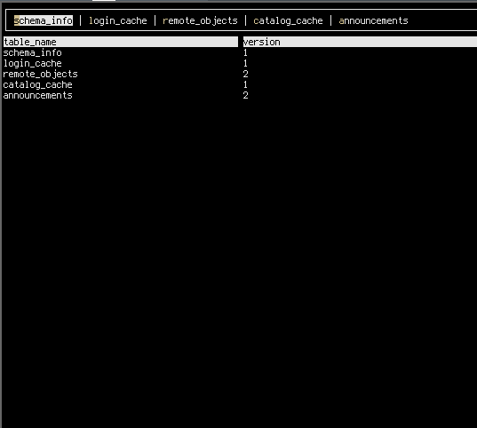

# Qb - a sqlite db viewer

Qb is a viewer for sqlite (with editing support).
Qb lets you do small lookups and changes (not implemented yet) to a db in a visual modeinside of the terminal. 
It's also a tool to quick get info about a db. 

What qb isn't:
- A tool to replace sql or other database syntax. 
- A enterprise tool to manage databases.

It's just a way to visualize a database.

## Install
qb is written in rust, so you need to install a rust compiler.  
Add $HOME/.cargo/bin to your $PATH and do:  

	cargo install

## Usage
	qb file.db

Using qb on sql files (not db files does nothing).

## Todo
- [ ] Editing
	- [ ] Transations
- [ ] Zooming in on field (often you don't need to see all the data but for the item selected)
- [ ] Searching
- [ ] Running custom sql
